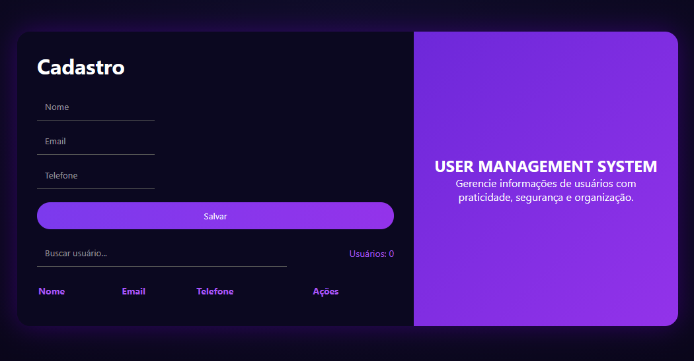
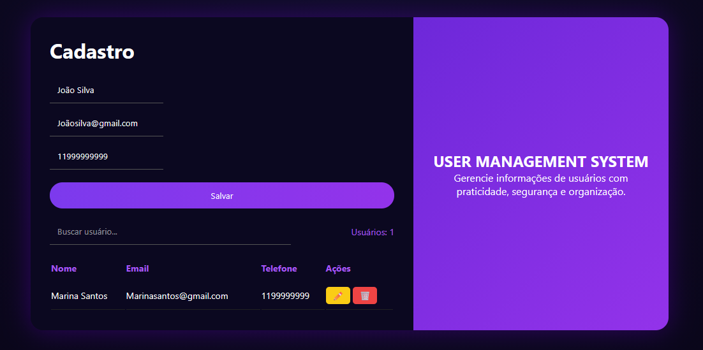
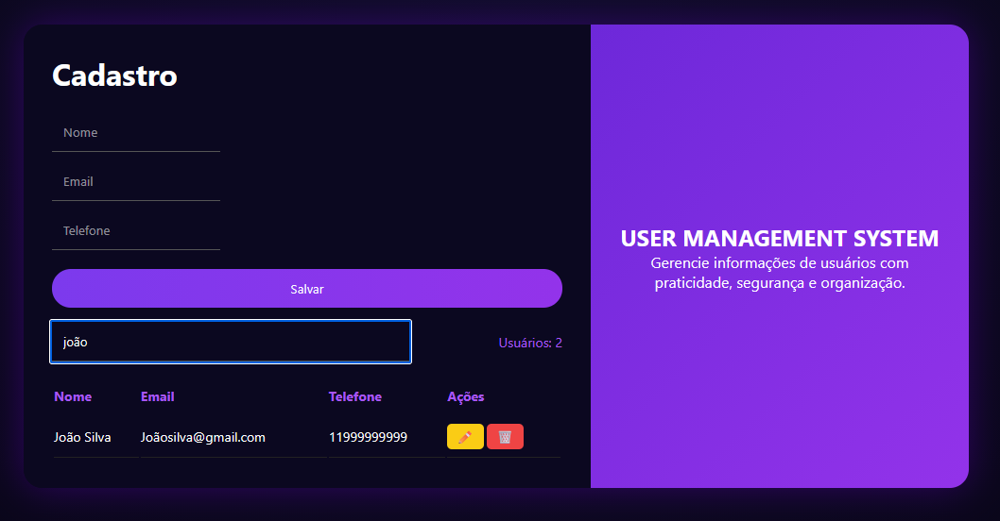
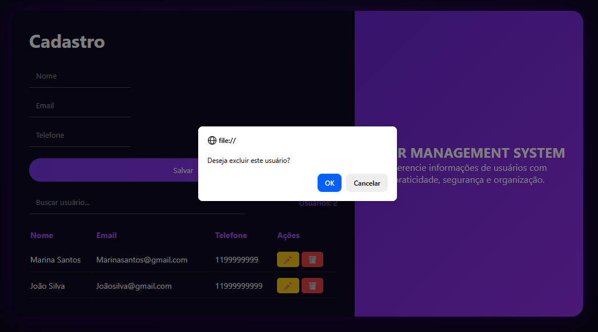
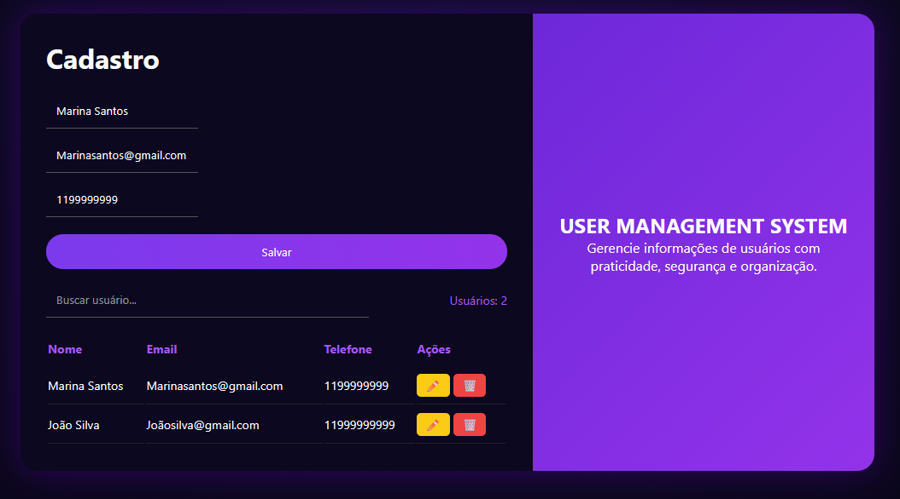

# User Management System

##   Sobre o Projeto

Este é um sistema de cadastro de usuários desenvolvido com foco em prática de fundamentos do desenvolvimento web. Esse projeto simula um CRUD completo (Create, Read, Update, Delete) utilizando apenas tecnologias de frontend, com persistência de dados no navegador através do **LocalStorage**. A interface foi projetada com um visual moderno em tema escuro, inspirado em layouts profissionais, proporcionando uma experiência mais agradável ao usuário.

---

##  Tecnologias Utilizadas

* HTML5
* CSS3
* JavaScript (Vanilla JS)
* LocalStorage

---

##  Funcionalidades

* ✔️ Cadastro de usuários
* ✔️ Listagem em tabela
* ✔️ Edição de dados
* ✔️ Exclusão de usuários
* ✔️ Busca/filtro em tempo real
* ✔️ Validação de formulário
* ✔️ Feedback visual (erros e sucesso)
* ✔️ Notificação (toast)
* ✔️ Contador de usuários
* ✔️ Limpeza automática do formulário

---

##   Objetivo

O objetivo deste projeto é praticar desenvolvimento frontend, incluindo:

* Manipulação do DOM
* Organização de código
* Lógica de programação
* Experiência do usuário (UX)
* Boas práticas de interface

---

##   Como executar

- Baixe ou clone o repositório
- Abra o arquivo 'index.html' no navegador

---

## Preview

### Tela Principal

### Cadastro Funcionando

### Busca de Usuários

### Ações (Excluir/Editar)

#### Ação Excluir

#### Ação Editar

---

##  Autora

Josiane Barbosa
Estudante de Análise e Desenvolvimento de Sistemas

---

## Contato

- Email: josiane.ssbarbosa@gmail
- LinkedIn: linkedin.com/in/josianebarbosa-s
- GitHub: github.com/JosianeBarbosa-s
